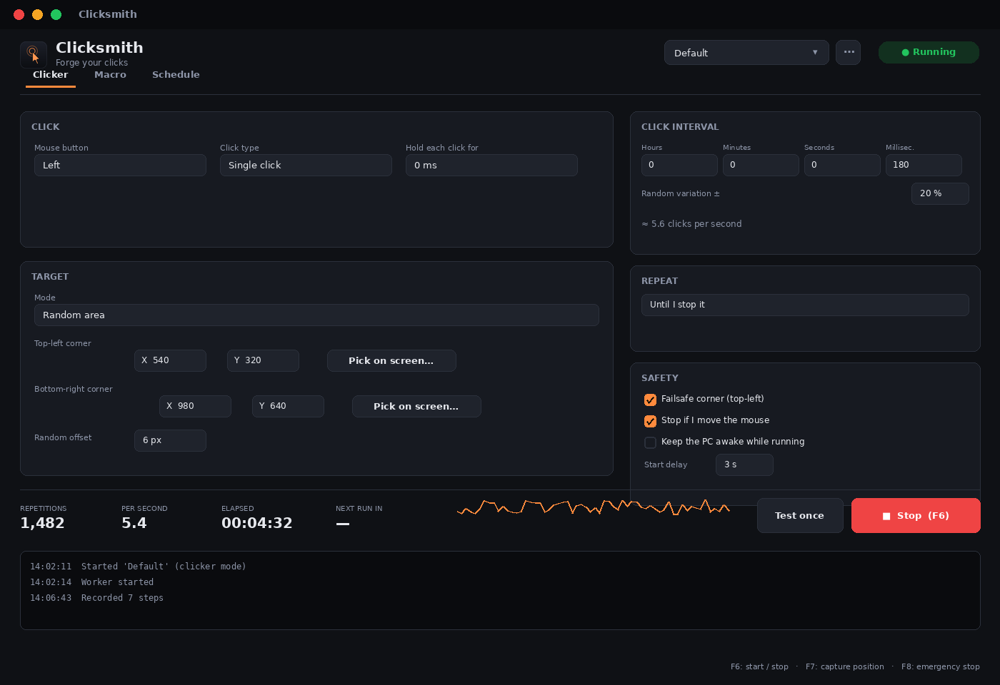
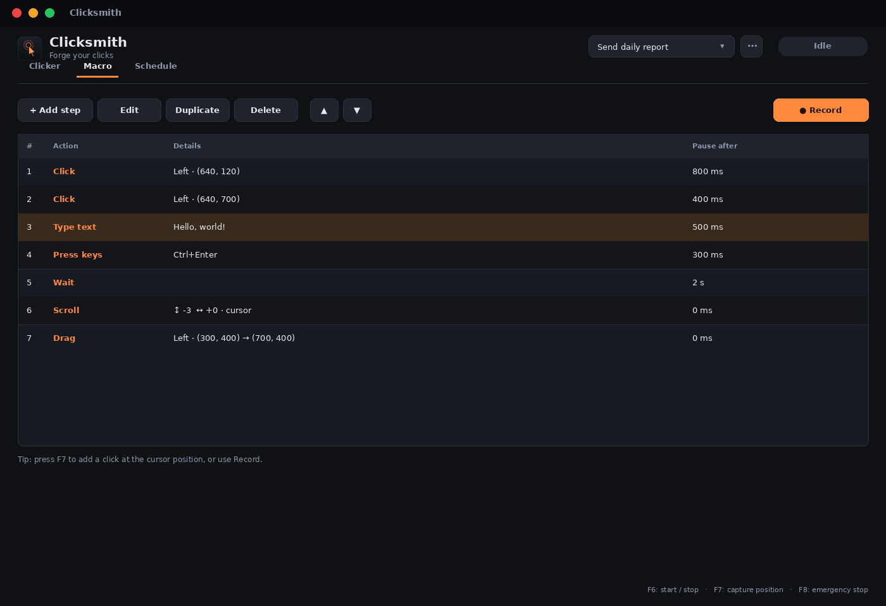

<div align="center">


# Clicksmith

**Forge your clicks.** An open-source auto clicker, macro recorder, Unicode typer, and
scheduler for Windows - all in one tool, with a real test suite behind it.

[](https://github.com/Niknam1382/clicksmith/actions/workflows/ci.yml)
[](https://github.com/Niknam1382/clicksmith/releases/latest)
[](LICENSE)
[](pyproject.toml)
[-41cd52.svg)](https://doc.qt.io/qtforpython/)
[](docs/BUILDING.md)

[Download](https://github.com/Niknam1382/clicksmith/releases/latest) ·
[Features](#-features) ·
[Why Clicksmith](#-why-clicksmith) ·
[Docs](docs/) ·
[Contributing](CONTRIBUTING.md)



</div>

## Contents

- [Features](#-features)
- [Download](#-download)
- [60-second tour](#-60-second-tour)
- [Why Clicksmith](#-why-clicksmith)
- [Profiles](#-profiles)
- [Headless / CLI / scripting](#-headless--cli--scripting)
- [Localization](#-localization)
- [Where things are stored](#-where-things-are-stored)
- [Responsible use](#-responsible-use)
- [Building from source](#-building-from-source)
- [Architecture](#-architecture--contributing)
- [FAQ](#-faq)
- [License](#-license)

## ✨ Features

**Clicker mode**
- Left / right / middle button, single / double / triple click, and click-and-hold.
- Interval control down to the millisecond, with an optional percentage of random jitter so
  timing doesn't look robotic.
- Three targeting modes: follow the cursor, a fixed point, or a random point inside an area
  (with its own pixel-jitter option for the fixed point).
- Three stop conditions: run until stopped, for a number of repetitions, or for a duration.

**Macro mode**
- A **recorder**: do the thing once with your real mouse and keyboard, and Clicksmith turns it
  into an editable list of steps - including the pauses between your actions.
- Or build steps by hand: click, move, drag, scroll, type text, press a key combination, wait.
- Full **Unicode text typing** - Persian, Arabic, CJK, emoji - independent of your keyboard's
  active layout (see [how](docs/ARCHITECTURE.md#coreinput---one-interface-three-backends)).
- An on-screen position picker for every coordinate field, so you never type pixel numbers by hand.

**Safety, by default**
- A **failsafe corner**: slam the mouse to the top-left of the screen to stop everything, instantly,
  mid-action.
- Optional "stop if I move the mouse" - so an area/fixed-point run gets out of your way the moment
  you touch the mouse yourself.
- A configurable start delay, so you have time to switch to the target window.

**Everything around the clicking**
- A daily/weekly **scheduler** - runs from the system tray, no need to keep the window open.
- Multiple named **profiles**, importable/exportable as plain JSON - see [Profiles](#-profiles).
- Global **hotkeys** for start/stop, capture-position, and emergency-stop, configurable in Settings.
- A **headless CLI** (`clicksmith run profile.json`) for scripting, scheduled tasks, or CI.
- **English and فارسی (Persian)**, with a real right-to-left layout - not just mirrored text.
- Dark and light themes.
- An **opt-in**, no-telemetry update check against GitHub Releases (off by default).

## 📦 Download

Grab the latest release from the **[Releases page](https://github.com/Niknam1382/clicksmith/releases/latest)**:

| File | Use this if... |
| --- | --- |
| `Clicksmith-Setup-<version>.exe` | You want a normal install: Start Menu shortcut, uninstaller. **Recommended.** |
| `Clicksmith-<version>-windows-x64.zip` | You want a portable copy: unzip anywhere, run `Clicksmith.exe`, nothing touches the registry. |

Both are built automatically from this exact source by [the release workflow](.github/workflows/release.yml)
on a clean GitHub Actions runner - never on a maintainer's own machine - and both come with a
`SHA256SUMS.txt` so you can verify what you downloaded. No installer bundleware, no ads, no
telemetry: see [Responsible use](#-responsible-use).

Prefer to run it from source, or need Linux/macOS? See
[Building from source](#-building-from-source).

## 🚀 60-second tour

1. **Clicker mode**: pick a mouse button and interval, choose a target (follow the cursor, a
   fixed point, or a random area), and press **Start** (`F6`) or the on-screen button.
2. **Need it to do more than click?** Switch to the **Macro** tab and press **● Record** - do the
   thing once, press the emergency-stop hotkey (`F8`) to finish, and your actions become an
   editable list of steps.
3. **Want it to run every day at 9am without you opening the app?** The **Schedule** tab runs a
   profile automatically while Clicksmith sits in the system tray.
4. **Multiple things to automate?** Save each as its own **profile** (top-right of the window) and
   switch between them, or export one as JSON to share - see [Profiles](#-profiles).



## 🆚 Why Clicksmith

Most free Windows "auto clicker" downloads are closed-source .exe files of unclear
provenance, often ad-bundled, and rarely updated - a well-known enough problem that
[other open-source alternatives call it out explicitly](https://github.com/hoaibaone/OP-Auto-Clicker).
Clicksmith is a ground-up, fully open-source rewrite with an actual test suite (see the CI badge
above) behind every feature:

| | **Clicksmith** | Typical free auto-clickers |
| --- | :---: | :---: |
| Open source | ✅ MIT | ❌ usually closed |
| No ads / no bundled installer | ✅ | ⚠️ varies, often bundled |
| Macro recorder (not just repeated clicking) | ✅ | ❌ rare |
| Unicode text typing (any language, any keyboard layout) | ✅ | ❌ essentially never |
| Scheduler (run at a specific time/day) | ✅ | ⚠️ paid tools only, typically |
| Profiles you can save, import, and share as plain JSON | ✅ | ❌ rare |
| Headless CLI / scriptable | ✅ | ❌ never |
| Automated tests + CI you can inspect | ✅ | ❌ n/a (closed source) |
| Portable build (no installer required) | ✅ | ⚠️ varies |

This isn't a knock on any one product by name - it's the honest state of the free-auto-clicker
space, which is exactly why Clicksmith exists. Judge the code yourself: it's all right here.

## 🗂 Profiles

A profile is a plain, human-readable JSON file - every setting in the window, saved. Use
**File → Export profile...** / **Import profile...** to share one, or drop a file straight into
your profiles folder (**File → Open profiles folder**). Several ready-made examples are included
in [`profiles/examples/`](profiles/examples/) - a fast clicker, a "human-like" area clicker, a
daily scheduled click, a Unicode paste-and-send macro, and more.

The full field-by-field format is documented in **[docs/PROFILE_FORMAT.md](docs/PROFILE_FORMAT.md)**.

## 💻 Headless / CLI / scripting

```powershell
clicksmith run profiles\examples\refresh-page-every-30s.json   # run a profile, no window
clicksmith run my-profile.json --count 10                      # override its stop condition
clicksmith run my-profile.json --dry-run                       # print actions, click nothing
clicksmith list                                                # list saved profiles by name
```

Useful for Task Scheduler, a script, or a CI job that needs to drive a Windows UI. `--dry-run`
uses the same fake input backend the test suite does, so you can sanity-check a profile with zero
risk of it actually clicking anything.

## 🌍 Localization

Clicksmith ships with English and فارسی (Persian, with a genuine right-to-left layout, not just
mirrored punctuation). Adding a language is one file - see
["Adding a language" in CONTRIBUTING.md](CONTRIBUTING.md#adding-a-language); a test
(`tests/test_i18n.py`) fails the build if any UI string is missing its translation, so a language
can never silently fall behind as features are added.

## 🔐 Where things are stored

- **Settings & profiles**: `%APPDATA%\Clicksmith` (Settings, Profiles as `.json`, and a rotating
  log file) - or a `data` folder next to `Clicksmith.exe` if you run it with `--portable`
  (the installer doesn't use this; the portable `.zip` build can).
- **Network**: none, except the update check described above, which is off unless you turn it on.
- **Telemetry**: none. There is no analytics code in this project at all.

## 🛡 Responsible use

Clicksmith automates real mouse/keyboard input - the same capability is legitimate for QA
automation, accessibility, and relieving repetitive strain, and is a Terms-of-Service violation
when pointed at a game or service that forbids it. That line is yours to know and respect; see
[SECURITY.md](SECURITY.md) for the full policy (including how to report a security issue).

## 🏗 Building from source

```powershell
git clone https://github.com/Niknam1382/clicksmith.git
cd clicksmith
python -m venv .venv && .venv\Scripts\activate
pip install -r requirements-dev.txt
python -m clicksmith          # run it
pytest -q                     # 100+ tests, most needing no display/mouse/keyboard at all
```

To build `Clicksmith.exe` and the installer yourself: `.\scripts\build_windows.ps1` - see
**[docs/BUILDING.md](docs/BUILDING.md)** for details and requirements.

## 🧠 Architecture & Contributing

The codebase is deliberately split into a GUI-free `core/` (data model, automation engine, input
backends, scheduler, recorder - all unit-tested without a real display, mouse, or keyboard) and a
`ui/` that's a thin PySide6 layer on top of it. See **[docs/ARCHITECTURE.md](docs/ARCHITECTURE.md)**
for the full picture, including why PySide6 was chosen over PyQt6.

Contributions are welcome - bug reports, features, translations, or example profiles. Start with
**[CONTRIBUTING.md](CONTRIBUTING.md)** (dev environment, project layout, how to add a language or
an example profile) and the **[Code of Conduct](CODE_OF_CONDUCT.md)**.

## ❓ FAQ

Does it work in games? Why does it ask for Administrator? Does it phone home? Answered in
**[docs/FAQ.md](docs/FAQ.md)**.

## 📜 License

[MIT](LICENSE) - use it, fork it, ship it, sell support for it. See [NOTICE](#third-party-notices)
below for the licenses of what it's built on.

### Third-party notices

Clicksmith is built with [PySide6](https://doc.qt.io/qtforpython/) (LGPL-3.0, © The Qt Company),
[pynput](https://github.com/moses-palmer/pynput) (LGPL-3.0 / BSD dual-licensed, © Moses Palmer),
and packaged with [PyInstaller](https://pyinstaller.org/) (GPL-2.0-with-exception, so it's fine to
package proprietary *or* MIT-licensed software like this with it) and, optionally,
[Inno Setup](https://jrsoftware.org/isinfo.php). None of their code is vendored into this
repository - they're installed as ordinary dependencies (see `requirements.txt`).

---

<div align="center">

If Clicksmith is useful to you, consider starring the repo - it helps other people find it.

<a href="https://star-history.com/#Niknam1382/clicksmith&Date">
  
</a>

</div>
